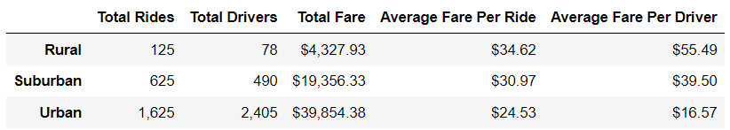
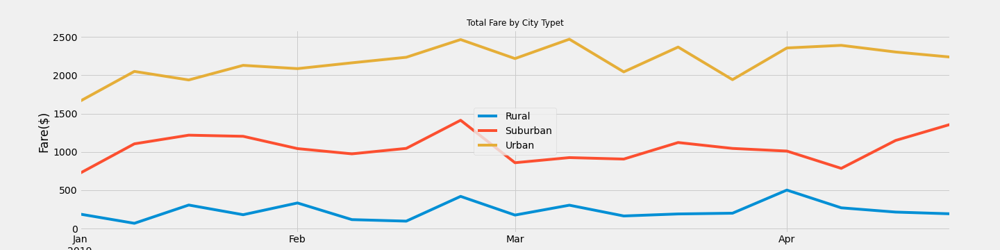

# PyBer_Analysis

## Overview of Project
Analyzing the ride-sharing data by city type in order to showcase the relationship between the type of city and the number of drivers, as well as the average fare in order to understand the market.  
 
## Results
1. By analyzing the total rides, drivers, and fares for city type we can see in the chart below that rural cities have the lower number of rides and drivers but the average per ride and per driver is the highest. and urban cities have the highest number of rides and drivers but the average per ride and per driver is the lowest.

 

2. When we look at the first 4 months of 2019 (Jan 1st - Apr28th) we can see the increase at the end of February was for all the city types. 

 

## Results
Based on the results we suggest the following:
1. Adding more drivers to rugal cities-  we can see that there is a growth potential at thous cities.
2. Decrease the number of drivers in urban cities in order to increase the average ride and driver fare.
3. Consider adding more drivers to suburban cities- because we can see that there is small growth potential in those cities.

